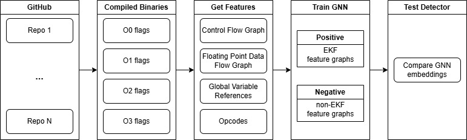

# AlgoTwin: GNN-Based Detector for Algorithm-Level Binary Code Similarity Detection

This project implements a **Graph Neural Network (GNN)** for analyzing binary files using graph-based representations of functions. The GNN is trained to distinguish between positive and negative function pairs and can be used to detect and rank functions based on their similarity to known positive examples.

---

## Features

- **Graph-Based Representation**: Extracts control flow and data flow graphs from binary functions using Ghidra's decompiler.
- **Graph Neural Network (GNN)**: Implements a GNN with contrastive loss for training on positive and negative function pairs.
- **Visualization**: Provides t-SNE visualization of graph embeddings after training.
- **Detection**: Detects and ranks functions in a binary file based on their similarity to positive embeddings.
- **Customizable**: Easily extendable to other binary analysis tasks.

---

## Requirements

### Operating System
- **Windows** (required for Ghidra integration)

### Dependencies
- **Java JDK 21**: [Download here](https://www.oracle.com/java/technologies/downloads/#java21)
- **Python Libraries**:
  - `torch`, `torch_geometric`, `torch_scatter`
  - `numpy`, `matplotlib`, `scikit-learn`
  - `pandas`, `tqdm`, `magic`
  - `pyghidra`

---

## Installation

1. **Clone the Repository**:
   ```bash
   git clone https://github.com/your-repo/ECE6254-Project.git
   cd ECE6254-Project
   ```

2. **Install Java JDK 21**:
   - Download and install Java JDK 21 from [here](https://www.oracle.com/java/technologies/downloads/#java21).

3. **Set Up the Environment**:
   - Run the setup.bat script to install Python dependencies and set up the environment:
     ```bash
     setup.bat
     ```

4. **Prepare Ghidra**:
   - Ensure the ghidra_11.3.1_PUBLIC_20250219 directory is present in the project folder.

5. **Prepare Binaries**:
   - Place your binaries in the binaries directory for training and testing.

---

## Usage

### 1. Train the Model
To train the GNN model on your dataset:
1. Ensure your dataset is defined in dataset.csv with the following format:
   ```
   Name,Function1,Function2,...
   binary1,function_name1,function_name2,...
   binary2,function_name3,function_name4,...
   ```

    For example, Ghidra will ingest all executable binaries in the `binaries/binary1` directory and look for all functions containing `function_name1`, `function_name2`.

2. Run the run.bat script to process binaries, train the model, and save the embeddings:
   ```bash
   run.bat
   ```

### 2. Detect Functions in a Binary
To detect and rank functions in a binary file:
1. Place the binary file (e.g., arducopter) in the project directory.
2. Run the detector.py script:
   ```bash
   python detector.py
   ```
3. Results will be saved in closest_functions.txt and printed to the console.

---

## Visualization

After training, the embeddings are visualized using t-SNE. The visualization is saved as `graph_embeddings.png` in the project directory.

- **Blue Points**: Positive embeddings
- **Red Points**: Negative embeddings

---

## File Structure

```
ECE6254-Project/
├── binaries/                     # Directory for training binaries
├── ghidra_11.3.1_PUBLIC_20250219/ # Ghidra installation directory
├── setup.bat                     # Script to set up the environment
├── run.bat                       # Script to train the model and run the detector
├── dataset.csv                   # CSV file defining the dataset
├── ProcessDataset.py             # Main script for processing binaries and training
├── detector.py                   # Script for detecting functions in a binary
├── positive_graphs.pkl           # Saved positive graphs (after processing binaries)
├── negative_graphs.pkl           # Saved negative graphs (after processing binaries)
├── positive_embeddings.json      # Saved positive embeddings (after training)
├── trained_gnn_model.pth         # Trained GNN model
├── model_dimensions.json         # Dimensions of the trained model
├── closest_functions.txt         # Output of the detector
└── graph_embeddings.png          # t-SNE visualization of graph embeddings
```

---

## Example Workflow

1. **Prepare Dataset**:
   - Add binaries and their target functions to dataset.csv.

2. **Train the Model**:
   - Run run.bat to process binaries, train the model, and save embeddings.

3. **Detect Functions**:
   - Use detector.py to rank functions in a binary based on their similarity to positive embeddings.

4. **Visualize Embeddings**:
   - Check `graph_embeddings.png` for a 2D visualization of the embeddings.

---



## Troubleshooting

1. **CUDA PyTorch Could Not Install**:
   - Assumes you have a CUDA based graphics card. For the CPU version, refer to the [PyTorch Geometric installation guide](https://pytorch-geometric.readthedocs.io/en/latest/notes/installation.html).

---

## References

- **Ghidra**: [Ghidra Official Website](https://ghidra-sre.org/)
- **PyTorch Geometric**: [PyTorch Geometric Documentation](https://pytorch-geometric.readthedocs.io/)
- **t-SNE**: [t-SNE Algorithm](https://lvdmaaten.github.io/tsne/)

---

## License

This project is licensed under the MIT License. See the `LICENSE` file for details.

---

## Contributors

- **Daniel Khoshkhoo** - Developer
- **Luca Gianantonio, Caroline Huang** - Dataset Construction
